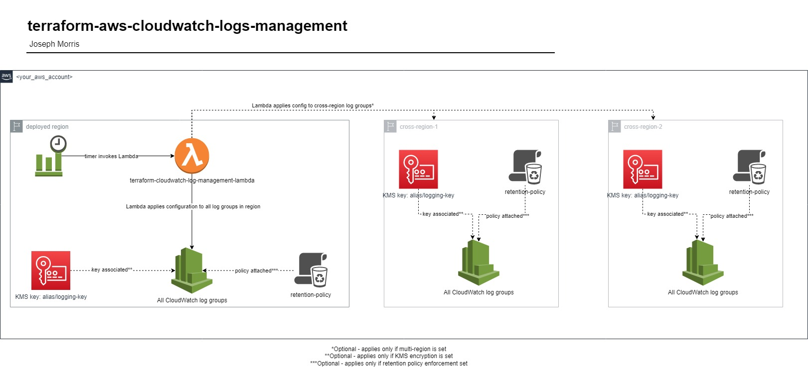

# terraform-aws-cloudwatch-logs-management
Automation for managing CloudWatch logs in AWS. Enforce retention policies and/or KMS encryption across all log groups in a single region or multiple regions.

## Please note the _all_ log groups phrase in the description. This will enforce a defined configuration on:
### - every log group in the AWS region the module is deployed into
### - every log group in the defined "cross_regions" AWS regions

-----

## Architecture

----

## Pre-Deployment Requirements (KMS encryption only)
These steps are only required if you want to use the KMS enforcement feature. Skip to the next section if not applicable. Due to KMS being a regional service, individual KMS keys will need to be created in each region you wish to deploy to. The aliases of these keys must be the exact same, since the Lambda will use these aliases to identify the appropriate key in each region. 
You can create these keys in your Terraform code or manually with the AWS console.
1. Create a symmetric key in AWS KMS (CloudWatch cannot encrypt with asymmetric keys)
2. Assign an alias to the KMS key, such as "log-management-key"
3. Attach a resource policy like the linked [here, lines 12-56](https://github.com/Han-Lon/terraform-aws-cloudwatch-logs-management/blob/main/examples/single-region-kms-and-retention/main.tf#L12-L56)
4. Repeat the above steps for all other regions that are in scope for your environment

----
## Inputs

| Name                   | Description                                                                                                                                                                                            | Type   | Default      | Required |
|------------------------|--------------------------------------------------------------------------------------------------------------------------------------------------------------------------------------------------------|--------|--------------|:--------:|
| invocation_rate        | The rate at which the log management lambda will be triggered. Must be a string with rate() or cron() format                                                                                           | string | "rate(1 day)" | No |
| cross_regions          | Other AWS regions to configure Cloudwatch logs for, besides the region deployed into. Set to \"None\" for no multi-region functionality                                                                | string | "None"       | No |
| retention_in_days      | Retention in days to apply to each log group. Refer to https://boto3.amazonaws.com/v1/documentation/api/latest/reference/services/logs.html#CloudWatchLogs.Client.put_retention_policy for valid values | string | "7"          | No |
| kms_key_alias          | The alias of the KMS key to use for CloudWatch log encryption. Must be already created in all desired regions.                                                                                         | string | "None"       | No |
| lambda_memory          | Amount of memory, in MB, to allocate to the Lambda function that will enforce the CloudWatch Log configuration. Increase if receiving timeout errors.                                                  | number | 128          | No |
| lambda_timeout         | Amount of time, in seconds, for the Lambda function timeout. Increase if receiving timeout errors.                                                                                                     | number | 30           | No |
| allow_kms_disassociate | Whether or not to allow the log manager Lambda to disassociate KMS keys from log groups if no KMS key alias is supplied. Defaults to "False"                                                           | string | "False"       | No |